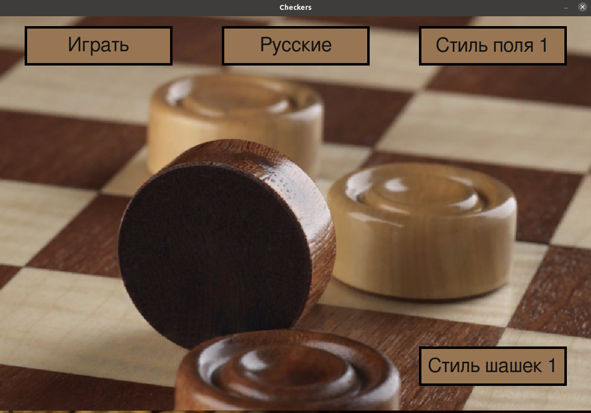

# Checkers
-игра шашки
-python pygame

Реализованы Русские и Международные шашки.

Есть возможность изменить цветовую схему доски и шашек. Есть возможность изобразить чёрные шашки в виде пользовательских картинок.
В файле settings.py можно указать новые ветовые схемы доски и шашек

