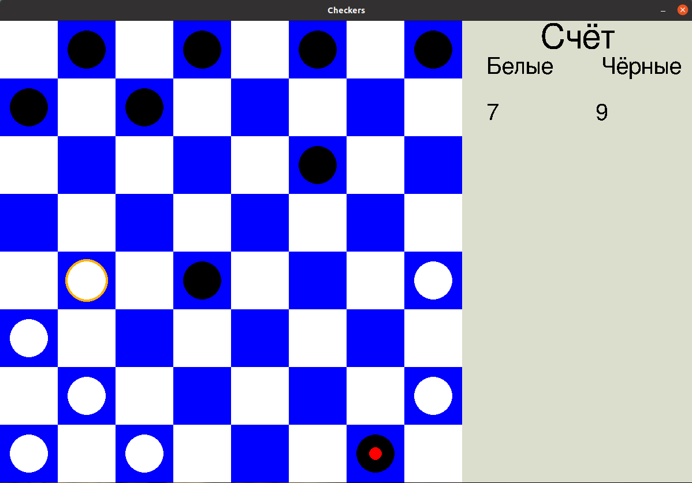
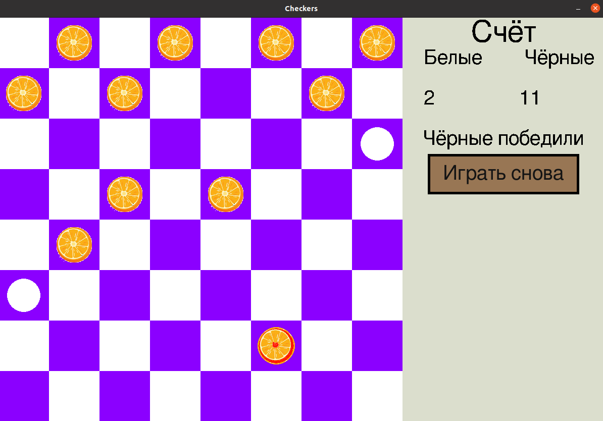

# Checkers
- stack `python pygame`

Реализованы Русские и Международные шашки.

Есть возможность изменить цветовую схему доски и шашек. Есть возможность изобразить чёрные шашки в виде пользовательских картинок.
В файле settings.py можно указать новые цветовые схемы доски и шашек.

